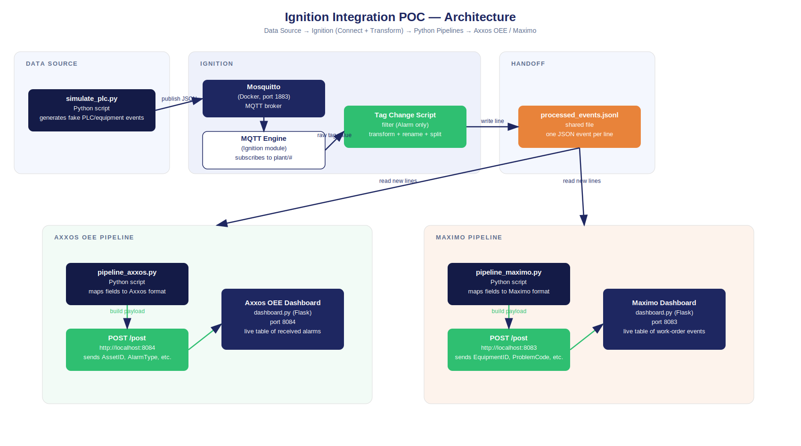

# Ignition Integration POC — Complete Documentation

*Prepared for: Developer training / Miro board content*
*Covers: use case, architecture, what was built, and an onboarding guide for developers new to Ignition*

---

## 1. Use Case Description

### English

The maintenance domain at the plant relies on two separate systems: **Maximo**, used for maintenance management (work orders, spare parts, maintenance activities), and **Axxos OEE**, used for production monitoring and Overall Equipment Effectiveness (OEE) tracking, including alarm and disturbance events.

Historically, data has moved between plant equipment and these systems through individual, purpose-built adapters and small transformation scripts. Over time this creates many disconnected integrations that are hard to maintain, poorly documented, and difficult to extend.

The goal of this POC is to demonstrate **Ignition as a central connectivity and transformation layer**: Ignition connects to the data source (equipment/PLC events), applies filtering and transformation logic (timestamp formatting, field renaming, splitting nested records), and hands off the processed data through a clean interface. From there, two **independent Python integration pipelines** — one for Axxos OEE, one for Maximo — pick up the processed data, apply system-specific field mapping, and deliver it to each destination system.

This POC proves the pattern end-to-end using simulated equipment data, a local Ignition instance, and mock Axxos/Maximo destinations (built as small local dashboards), so the same pattern can later be pointed at real plant data sources and real Axxos/Maximo APIs.

### Hindi

Plant ke maintenance domain mein do alag-alag systems use hote hain: **Maximo**, jo maintenance management (work orders, spare parts, maintenance activities) ke liye use hota hai, aur **Axxos OEE**, jo production monitoring aur Overall Equipment Effectiveness (OEE) tracking ke liye use hota hai, jisme alarm aur disturbance events bhi shamil hain.

Ab tak, plant equipment se in systems tak data alag-alag, purpose-built adapters aur chhoti transformation scripts ke through jata raha hai. Time ke saath ye bahut saari disconnected integrations bana deta hai, jinhe maintain karna mushkil hota hai, jo poorly documented hoti hain, aur jinhe extend karna difficult hota hai.

Is POC ka goal hai **Ignition ko ek central connectivity aur transformation layer** ke roop mein demonstrate karna: Ignition data source (equipment/PLC events) se connect karta hai, filtering aur transformation logic apply karta hai (timestamp formatting, field renaming, nested records ko split karna), aur processed data ko ek clean interface ke through aage bhejta hai. Wahan se, do **independent Python integration pipelines** — ek Axxos OEE ke liye, ek Maximo ke liye — processed data ko pick karti hain, apna system-specific field mapping apply karti hain, aur use apne-apne destination system tak deliver karti hain.

Ye POC is poore pattern ko end-to-end prove karta hai simulated equipment data, ek local Ignition instance, aur mock Axxos/Maximo destinations (chhote local dashboards ke roop mein bane hue) use karke — taaki yehi pattern baad mein real plant data sources aur real Axxos/Maximo APIs ke saath use kiya ja sake.

---

## 2. Architecture Diagram



**Flow in words:**

```
simulate_plc.py (fake PLC/equipment data)
        │  publishes JSON over MQTT
        ▼
Mosquitto (Docker, port 1883) — MQTT broker
        │
        ▼
Ignition — MQTT Engine module (subscribes to plant/#)
        │  raw tag value
        ▼
Ignition — Tag Change Script
        │  filter (Alarm events only)
        │  transform (rename fields, reformat timestamp)
        │  split (nested error array → individual messages)
        ▼
processed_events.jsonl (shared file — the handoff point)
        │
        ├──────────────────────────┐
        ▼                          ▼
pipeline_axxos.py           pipeline_maximo.py
(maps fields to             (maps fields to
 Axxos format)                Maximo format)
        │                          │
        ▼                          ▼
Axxos OEE Dashboard          Maximo Dashboard
(Flask, port 8084)           (Flask, port 8083)
```

**Why this design:**
- Ignition's job is limited to **connect + transform** — it does not talk to Axxos or Maximo directly.
- The **shared file** is a simple, dependency-free handoff point between Ignition and external Python processes, avoiding the need to install extra REST/MQTT publish modules for the POC.
- The **two pipelines are fully independent** — each does its own field mapping and its own delivery, mirroring how a real integration would have two separate, purpose-built pipelines rather than one shared script.

---

## 3. What We Built — Step by Step Summary

| # | Component | What it does |
|---|-----------|---------------|
| 1 | `simulate_plc.py` | Publishes fake equipment events (JSON) to an MQTT topic every 5 seconds, standing in for a real PLC/sensor |
| 2 | Mosquitto (Docker) | MQTT broker that carries the data from the simulator to Ignition |
| 3 | Ignition Project (`POC_Maintenance_Integration`) | Container for all the tags and scripts built in this POC |
| 4 | MQTT Distributor + MQTT Engine modules | Free Cirrus Link modules that let Ignition subscribe to MQTT topics as tags |
| 5 | Custom Namespace (`PlantEvents`, topic `plant/#`) | Tells MQTT Engine exactly which topic to bring in as raw (non-Sparkplug) tags |
| 6 | `ProcessedBatch` memory tag | Holds the latest transformed/processed result, visible inside Ignition for the demo |
| 7 | Tag Change Script (`onTagChange`) | The core transform logic: filters for Alarm events, reformats the timestamp to ISO 8601, renames fields, and splits a multi-error event into one message per error |
| 8 | `processed_events.jsonl` | Shared file that Ignition appends processed events to — one JSON object per line |
| 9 | `pipeline_axxos.py` | Independent Python process that tails the shared file, maps fields to an Axxos-style schema (`AssetID`, `AlarmType`, `FaultCode`...), and POSTs to the Axxos mock API |
| 10 | `pipeline_maximo.py` | Independent Python process that tails the same file, maps fields to a Maximo-style schema (`EquipmentID`, `ProblemCode`...), and POSTs to the Maximo mock API |
| 11 | `dashboard.py` | A small Flask app that plays the role of both Axxos OEE and Maximo — receives the POSTs and displays a live, auto-refreshing table of everything received, so the flow can be watched visually |

**Tools used:** Docker Desktop (Mosquitto broker), Ignition (local instance, Designer + Gateway), Python (simulator, both pipelines, dashboard), MQTT Explorer (optional GUI to visually inspect MQTT traffic).

---

## 4. Developer Onboarding — Getting Comfortable with Ignition

*This section is written for a developer who has never used Ignition before, so it can be dropped directly into Miro as onboarding content.*

### 4.1 What Ignition actually is

Ignition is an industrial platform that sits between plant-floor data (PLCs, sensors, MQTT, OPC-UA) and everything that needs that data (dashboards, databases, other business systems). Think of it as **connect → structure → transform → publish**, all in one tool, rather than writing custom adapters for every pair of systems.

Two things a new developer should get comfortable with early:
- **The Gateway** (`http://localhost:8088`) — the web-based admin console. This is where modules, connections, and projects are configured.
- **The Designer** — a desktop application (launched via Gateway) where tags, scripts, and screens are actually built. This is where most day-to-day development happens.

### 4.2 Core concepts to understand

| Concept | What it means |
|---|---|
| **Project** | A container for everything you build — tags, scripts, screens. Everything in this POC lives inside one project. |
| **Tag** | A named data point Ignition tracks. Can come from a live source (like an MQTT topic) or be a "memory tag" you create yourself to hold a value. |
| **Tag Provider** | A namespace for tags — e.g. `default` (your own tags) vs `MQTT Engine` (tags auto-created from subscribed topics). |
| **Module** | An installable add-on that gives Ignition new capabilities — e.g. MQTT Engine, MQTT Distributor. Most are free; some need a license for production use. |
| **Gateway Event Script** | Server-side code that runs automatically on some trigger — a tag changing value, a timer, project startup, etc. This is where the transformation logic in this POC lives. |
| **Tag Change Script** | A specific type of Gateway Event Script that runs every time a chosen tag's value changes. Its entry-point function is `onTagChange(...)` (in Ignition 8.3.x) — this naming matters, using the wrong function name means the script silently never runs. |

### 4.3 The pattern this POC teaches

1. **Get data in** — connect Ignition to a source (MQTT, OPC-UA, database, REST). In this POC: MQTT Engine subscribing to a Mosquitto topic.
2. **Make it usable** — inspect the raw structure, then write a script that filters, reformats, renames, and restructures it as needed.
3. **Hand it off cleanly** — Ignition doesn't need to know about every downstream system. It publishes processed data to one place (a file, an MQTT topic, or a REST endpoint), and lets other systems/pipelines take it from there.
4. **Keep destination-specific logic outside Ignition** — each destination system's own field mapping and delivery logic lives in its own independent script/service, not tangled into Ignition itself.

### 4.4 Common first mistakes (from this POC)

- **Wrong tag provider when creating a tag** — a new tag must be created under `default` (or another writable provider), not under `MQTT Engine`, which only shows auto-generated tags.
- **Wrong script entry-point function name** — Ignition 8.3.x expects `onTagChange(...)`, not the older `valueChanged(...)`. A script that "saves fine" but never produces output is often this.
- **Port conflicts** — Ignition's own MQTT Distributor tries to run its own broker on port 1883 by default, which conflicts with an external Mosquitto broker on the same port. Either disable it or move it to a different port.
- **JSON payload auto-parsing** — MQTT Engine has an option to automatically parse JSON payloads into individual tags. For this POC it was deliberately left off, so the raw JSON string could be parsed and transformed manually in script — useful for a training demo of transformation logic, but worth knowing this shortcut exists for production use.

---

## 5. Suggested Miro Board Structure

For laying this out as a Miro board (frames left to right):

1. **Frame 1 — Use Case** (Section 1 content, English + Hindi side by side)
2. **Frame 2 — Architecture** (the diagram image + the flow-in-words block)
3. **Frame 3 — What We Built** (the table from Section 3, one sticky note per row works well)
4. **Frame 4 — Ignition Basics** (Section 4.1 and 4.2 — good as definition cards)
5. **Frame 5 — The Pattern** (Section 4.3 — good as a 4-step numbered flow)
6. **Frame 6 — Gotchas** (Section 4.4 — good as warning-style sticky notes)
7. **Frame 7 — Live Demo** (leave blank — this is where you run the POC live and narrate against Frames 2 and 3)
